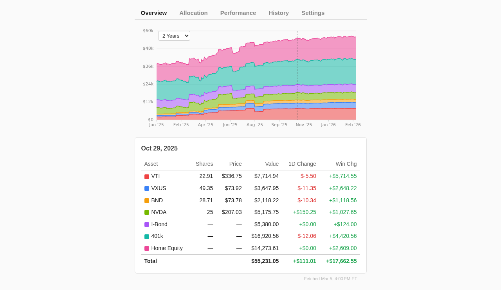
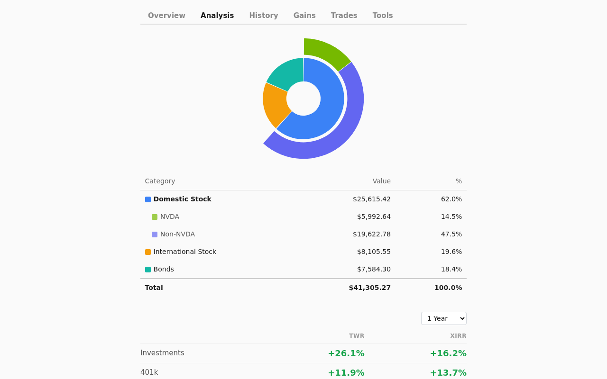
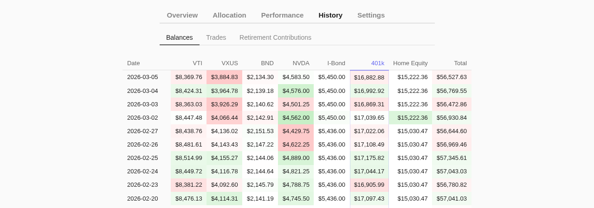
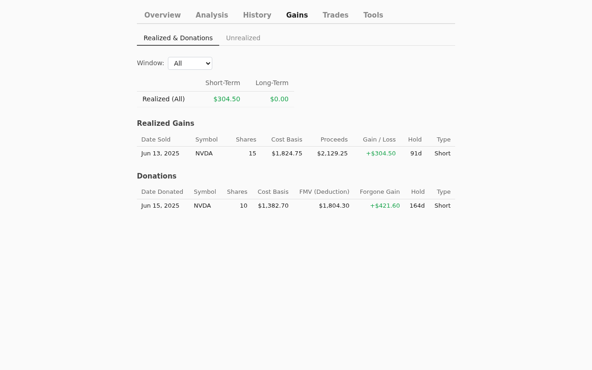
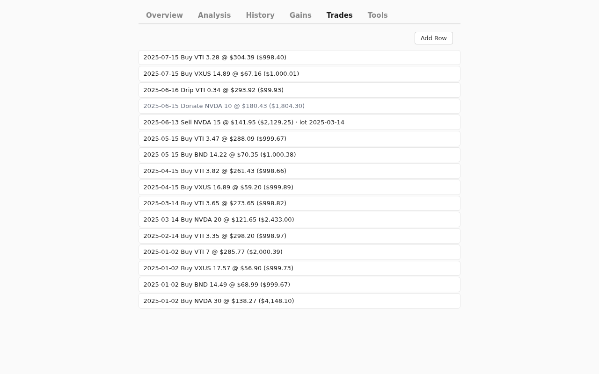
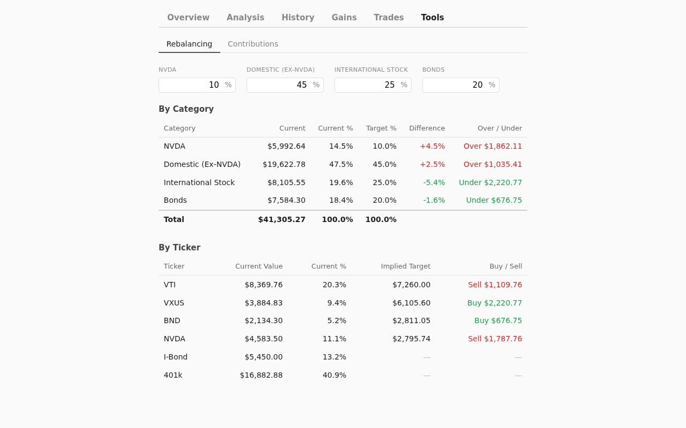

# Stonks

A personal portfolio tracker built on plain text files, zero dependencies, and full data ownership.



## Design Philosophy

- **Data is just files** -- plain JSON and CSV that you can read and edit with any text editor. No database, no proprietary formats or lock-in.
- **Zero dependencies** -- Node.js built-in modules only. No npm install, no package.json, no build step.
- **Security-first** -- strict Content Security Policy (`default-src 'none'`), no CDNs, no external requests from the browser. Optional HTTP Basic Auth for access control.
- **Designed to be transparent** -- well-documented architecture meant to be studied, adapted, or used as a starting point for your own tools.

## Features

Tracks stocks, ETFs, and individual equities via daily market prices, retirement accounts (401k, HSA, 403b) via proxy-based interpolation, and formula-driven assets like mortgage equity and I-bonds. Six tabs covering different aspects of portfolio tracking:

**Overview** -- Stacked area chart with time window filtering and hover detail panel.

**Analysis** -- Exposure breakdown by category with fractional allocation tracking across index funds and retirement accounts. Includes annualized TWR and XIRR return metrics.



**History** -- Daily portfolio values table with inline editing for retirement account ground-truth values.



**Gains** -- Capital gains report (FIFO or average cost). Realized & Donations sub-tab has a time window filter (default YTD) that updates the ST/LT summary and both tables. Unrealized sub-tab shows a ST/LT summary and per-symbol rows with expandable lot-level detail.



**Trades** -- Editable transaction log with save-to-server.



**Tools** -- Rebalancing calculator and contribution worksheet.



## Quickstart

The repo ships with demo data in `demo-data/` — a sample portfolio with US stocks, international funds, bonds, a 401k, and home equity — so you can explore the UI immediately:

```bash
DATA_DIR=./demo-data node app/serve.js
# Open http://localhost:8000
```

**Requirements:** Node.js (any recent version).

To set up your own portfolio data, see the [Setup Guide](docs/setup.md). Two paths are available:

- **Docker** (recommended) — only Docker required, no local Python or Node.js. A price-fetching container keeps data current automatically.
- **Local** — Node.js + Python 3.10+, good if you want to see your data immediately and iterate without Docker.

## Docker Deployment

The recommended path for real data. Requires only Docker — no local Node.js or Python installation needed. A price-fetching container runs every 5 minutes during US market hours and keeps prices current automatically.

```bash
cp .env.example .env
# Edit .env: set DATA_DIR, PORT, AUTH_PASS
docker compose up -d
```

Prepare your data files first (trades, config, optionally retirement and assets), then `docker compose up -d`. Prices backfill automatically within a minute or two. See the [Setup Guide](docs/setup.md) for the full walkthrough.

## Data Model

All your financial data lives in a handful of plain files in your data directory (conventionally `data/`, which is gitignored) — human-readable and editable with any text editor:

| File | Purpose |
|------|---------|
| `trades.json` | Transaction log — buys, sells, donations, dividend reinvestments |
| `market.csv` | Daily closing prices (fetched automatically or added by hand) |
| `config.json` | Exposure categories, rebalancing targets, chart colors, capital gains method |
| `retirement.json` | Manual accounts (401k, HSA) with contribution history and optional ground-truth values |
| `assets.json` | Formula-driven assets — mortgage equity, I-bonds |

Format details and examples for each file are covered in the [Setup Guide](docs/setup.md).

## Architecture

Key files:

| File | Purpose |
|------|---------|
| `app/serve.js` | Zero-dependency Node HTTP server |
| `app/js/app.js` | Main application entry point |
| `app/js/*.js` | Feature modules (data, gains, returns, retirement, assets, tools, etc.) |
| `utils/tickers/fetch_prices.py` | Market-state-aware price fetcher using yfinance |

## Testing

```bash
node --test tests/
```

Uses Node's built-in `node:test` runner. No additional test dependencies.
