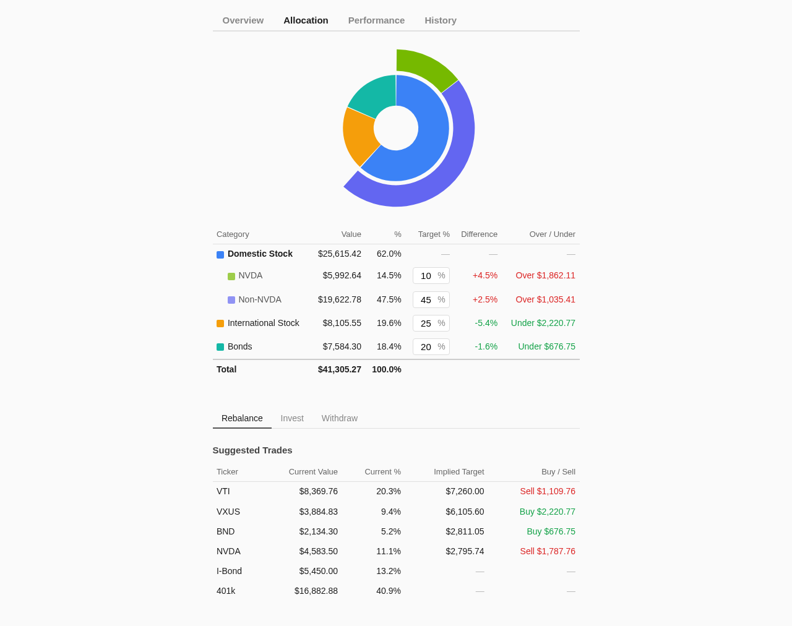

# Fractional Exposure Tracking

Most portfolio trackers show you what you own — "10 shares of VTI." Stonks goes a step further and shows you what you're *exposed to*. If VTI is a total US market fund that's ~6.7% NVIDIA, and you also hold NVIDIA directly, your true NVIDIA exposure is higher than either position alone suggests.

This matters for concentration risk. If you're running a portfolio with a handful of ETFs plus some individual stocks, the ETFs almost certainly overlap with your individual positions. Fractional exposure tracking makes that overlap visible.



## How it works

Every symbol in your portfolio maps to one or more **categories** via `exposure.allocations` in `config.json`. Each symbol maps to an object of `{ category: fraction }` pairs — the fraction is the portion of that symbol's value attributed to the category. Fractions for a given symbol must sum to 1.0.

```json
{
  "exposure": {
    "allocations": {
      "NVDA": { "NVDA": 1.0 },
      "VTI":  { "NVDA": 0.067, "Domestic (ex-NVDA)": 0.933 },
      "VXUS": { "International": 1.0 },
      "BND":  { "Bonds": 1.0 }
    }
  }
}
```

Here VTI is split: 6.7% of its value counts toward the "NVDA" category, and the remaining 93.3% toward "Domestic (ex-NVDA)." Direct NVDA shares are 100% in the "NVDA" category.

## Worked example

Suppose on a given day your positions are worth:

| Symbol | Value |
|--------|------:|
| NVDA   | $540 |
| VTI    | $6,200 |
| VXUS   | $2,800 |
| BND    | $2,000 |

Applying the fractions:

**NVDA category:**
- Direct NVDA: $540 x 1.0 = $540
- VTI's NVDA slice: $6,200 x 0.067 = $415
- **Total NVDA exposure: $955**

**Domestic (ex-NVDA) category:**
- VTI's non-NVDA slice: $6,200 x 0.933 = $5,783
- **Total: $5,783**

**International:**
- VXUS: $2,800 x 1.0 = $2,800

**Bonds:**
- BND: $2,000 x 1.0 = $2,000

**Portfolio total (mapped): $11,538**

So your true NVDA exposure is $955 / $11,538 = **8.3%**, even though direct NVDA shares are only $540 / $11,538 = 4.7% of the portfolio.

## Retirement and asset accounts

The same allocation system applies to retirement accounts and deterministic assets. A 401k invested in a target-date fund with known allocations can be split across categories:

```json
"401k": { "NVDA": 0.05025, "Domestic (ex-NVDA)": 0.69975, "International": 0.25 }
```

This 401k is treated as 75% domestic (with the domestic portion split the same way as VTI: 6.7% NVDA, 93.3% non-NVDA) and 25% international. Its interpolated daily value (see [Retirement Accounts](retirement.md)) gets split across those categories, so the Allocation tab reflects your total exposure across all accounts.

An I-bond maps entirely to bonds:

```json
"I-Bond": { "Bonds": 1.0 }
```

## Display configuration

The `exposure.display` array controls what rows appear in the Allocation tab's shared category table:

```json
{
  "display": [
    { "name": "Domestic Stock", "color": "#3b82f6", "subcategories": "NVDA, Domestic (ex-NVDA)" },
    { "name": "NVDA",           "color": "#76b900", "indent": true, "category": "NVDA" },
    { "name": "Non-NVDA",       "color": "#6366f1", "indent": true, "category": "Domestic (ex-NVDA)" },
    { "name": "International Stock", "color": "#f59e0b", "category": "International" },
    { "name": "Bonds",          "color": "#14b8a6", "category": "Bonds" }
  ]
}
```

- **`category`**: maps to a single allocation category. The row's value is the sum of all symbol contributions to that category.
- **`subcategories`**: comma-separated list of categories to sum. Used for group rows that aggregate child rows.
- **`indent`**: renders the row as a sub-row under the preceding group.
- **`color`**: used in the donut chart displayed at the top of the Allocation tab.
- **`target`**: (optional) rebalancing target percentage for this category. Display rows with `target` set define the rebalancing categories — see below.

This gives you a hierarchical view: "Domestic Stock" is the sum of NVDA + Non-NVDA, with the two subcategories shown indented beneath it.

## Rebalancing integration

The Allocation tab's Rebalance, Invest, and Withdraw sub-tabs all derive their categories from display rows that have a `target` field. Add `target` (a percentage) to the display rows you want to rebalance against, and add a `tradeable` array to `exposure`:

```json
{
  "exposure": {
    "display": [
      { "name": "Domestic Stock", "color": "#3b82f6", "subcategories": "NVDA, Domestic (ex-NVDA)" },
      { "name": "NVDA",           "color": "#76b900", "indent": true, "category": "NVDA", "target": 10 },
      { "name": "Non-NVDA",       "color": "#6366f1", "indent": true, "category": "Domestic (ex-NVDA)", "target": 45 },
      { "name": "International Stock", "color": "#f59e0b", "category": "International", "target": 25 },
      { "name": "Bonds",          "color": "#14b8a6", "category": "Bonds", "target": 20 }
    ],
    "tradeable": ["NVDA", "VTI", "VXUS", "BND"]
  }
}
```

Target percentages should sum to 100. Only display rows with `target` participate in rebalancing — the "Domestic Stock" group row above has no target, so it's just a display grouping.

The three sub-tabs each answer a different question, but all share the same donut chart and category table with inline target % inputs:

- **Rebalance**: Shows the gap between current and target allocation for each category, plus a suggested buy/sell amount per ticker to close the gap — no cash amount needed.
- **Invest**: Enter a dollar amount to invest. Shows how to allocate new cash across tickers to move toward targets.
- **Withdraw**: Enter a dollar amount to withdraw. Shows which tickers to sell to move toward targets.

The solver accounts for symbols that span multiple categories (e.g., selling VTI affects both the NVDA and Domestic buckets simultaneously).

## Adding a new symbol

When you add a new ticker to your portfolio:

1. Add an allocation entry in `config.json` — fractions for the new symbol must sum to 1.0
2. If it belongs to an existing category, you're done
3. If it's a new category, add a `display` entry (optionally with a `target` for rebalancing)
